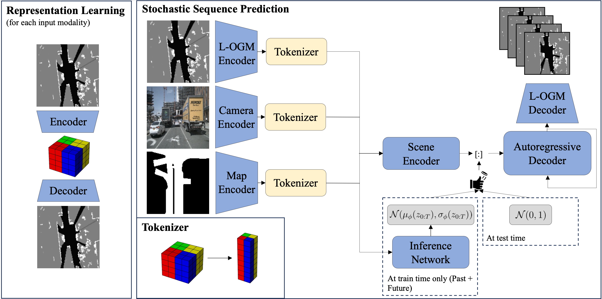
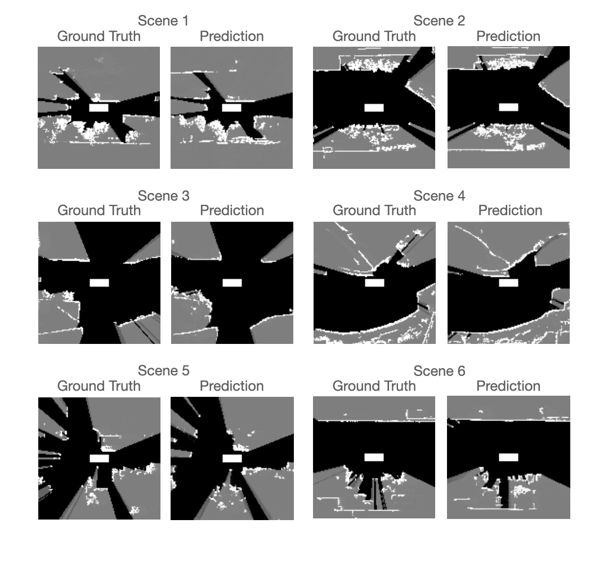
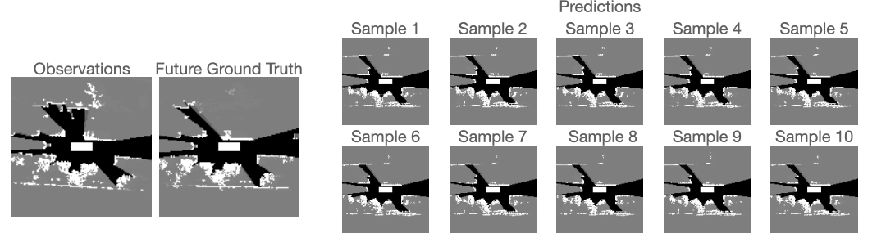
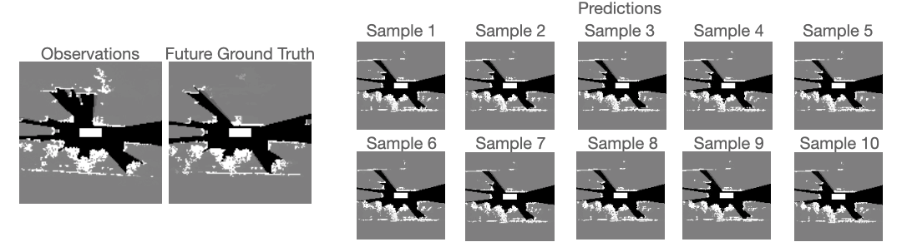
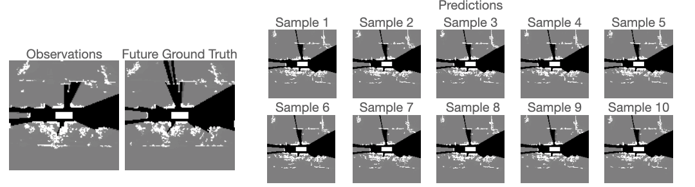
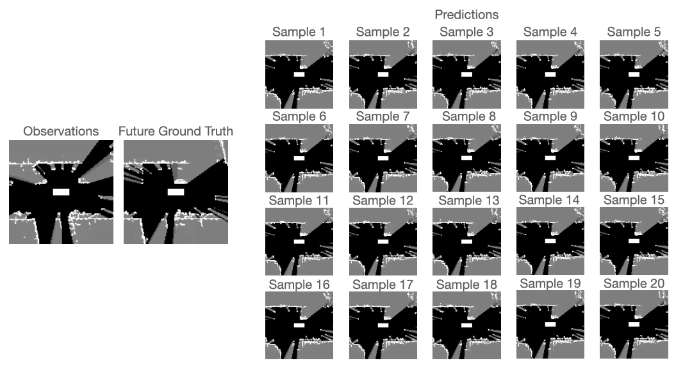
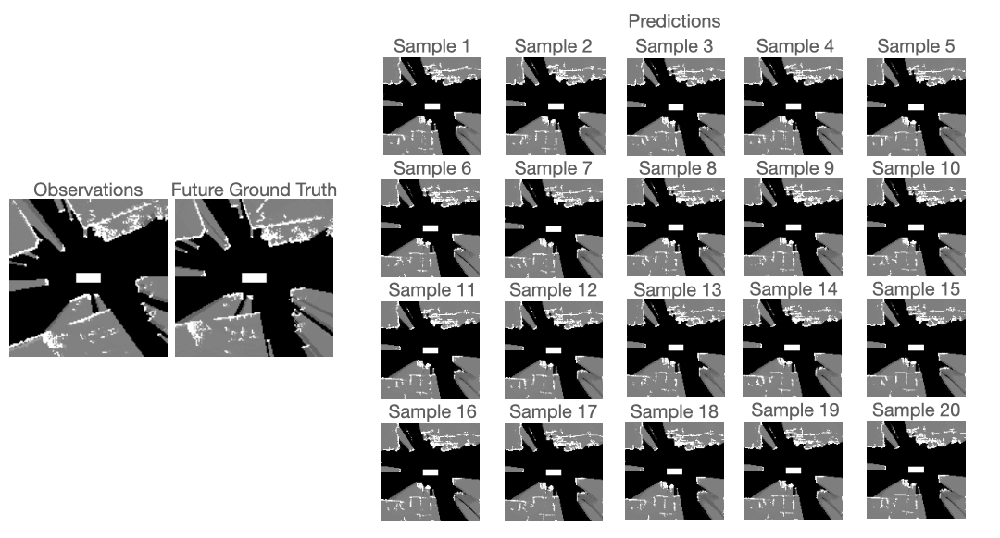

# LOPR: Latent Occupancy PRediction using Generative Models

This is the implementation of LOPR used in "LOPR: Latent Occupancy PRediction using Generative Models". In this repo, we provide the implementation and the visualization of our predictions.

## Abstract:




Environment prediction frameworks are integral for autonomous vehicles, enabling safe navigation in dynamic environments. Prior approaches have used occupancy grid maps as bird's eye-view representations of the scene, optimizing prediction architectures directly in grid cell space. While these methods have achieved some degree of success in spatiotemporal prediction, they occasionally grapple with unrealistic and incorrect predictions. 
We claim that the quality and realism of the forecasted occupancy grids can be enhanced with the use of generative models. We propose a framework that decouples occupancy prediction into two parts: representation learning and stochastic prediction within the learned latent space. 
Our approach allows for conditioning the model on other commonly available sensor modalities such as RGB-cameras and high definition~(HD) maps. We demonstrate that our approach achieves state-of-the-art performance and is readily transferable between different robotic platforms on the real-world NuScenes, Waymo Open, and our custom robotic datasets.

## Visualization of example predictions (L-OGM conditioned only)

Each scene consists of observation (0.5s), ground truth future (3.0), and 20 randomly sampled predictions (3.0s). Each grid's cell contains a continuous value between 0 (black) and 1 (white) representing a probabilty of occupancy. Ground truth grids are generated with lidar sensor measurements. As a result, the dataset doesn't require any manual labelling and the prediction network can be trained in the self-supervised fashion. However, contrary to vectorized occupancy grid approaches that relies on the object detection framework, the grids are significantly noisier due to the stochasticity in the lidar's ray hits with objects, random reflections, and myriad of other small objects (trees, leaves, barriers, curbs, etc.). Below, we visualize example of predictions generated by LOPR. We can observe that our framework is capable of realistically predicting observed agents and inferring unobserved agents entering the field of view of the L-OGM. Ego-vehicle visualized in the center moves from right to left.



Scene 1 - LOPR accurately predicts vehicles' motion surrouding our ego vehicle, and infer the vehicle entering the scene (top right corner).

Scene 2 - Bus is turning in front of the ego vehicle. Our framework correctly infers the future motion of the bus.

Scene 3 - The static environment is correctly propagated and vehicle entering the scene from the right side is reaslitically predicted.

Scene 4 - Traffic on an unusally shaped road is corretly predicted.

Scene 5 - Correctly predicted traffic surrounding traffic.

Scene 6 - Realistcally inferred static environment. 

## Visualization of different prediction samples (L-OGM conditioned only)

Below, we visualize couple of examples of predictions from Nuscenes Dataset that captures challenging scenarios due to the unknwon intent of the agent, occlusions, and partial observability. Our framework realistically forecasts potential futures of observed agents and reasons over the plausible occluded environments and other agents entering the scenes. 

Scene 1: Ego vehicle moving to the left is surrounded by other traffic particpants. In the observed grids, the bus located above the ego vehicle is occluding majority of the environment. LOPR correctly predicts the motion of observed agents. LOPR also infers a potential agent entering the scene (Samples 1, 6, 7) and different variations of the unobserved environment (all other samples).


<!-- Scene 2: Ego vehicle moving to the left is surrounded by other traffic particpants. In the observed grids, the bus located above the ego vehicle is occluding majority of the environment. LOPR infers: potential intersection  (Samples 2), potential oncoming agents following the bus similar to the ground truth (Samples 4, 9), parked cars that are occluded in the observed grids by the bus (Samples 1, 8), and an empty straight road (Samples 5, 6, 7, 10).
 -->

Scene 2: Ego vehicle moving to the left is surrounded by other traffic particpants. Traffic above the ego vehicle is moving in the opposing direction to the right side of the grid. LOPR correctly predicts the motion of observed agents. LOPR also infers a potential agent entering the scene similar to ground truth (Samples 1, 6) and different variations of the unobserved environment (all other samples)


<!-- Scene 2: Ego vehicle moving to the left is surrounded by other traffic particpants. Traffic above the ego vehicle is moving in the opposing direction to the right side of the grid. In the observed grids, the vehicle is passing our ego vehicle and moving to the right. In the ground truth future, the passing vehicle is immediately followed by another vehicle. For example, our framework infers: another vehicle following the observed passing vehicle similar to the ground truth future (Sample 13), a vehicle parked passing below our ego vehicle (Samples 1, 7), potential intersection (Sample 4), and a realtively empty road (in all other samples).


Scene 3: Ego vehicle turning at the intersection surroudned by traffic surrounded by other traffic particiapnts. Our framework realistically forecasts potential futures of observed agents and reasons over the plausible occluded environments and other agents entering the scenes. 
 -->

## Training

Code release is coming soon.

We provide the implementation details in the `code` directory. Before running each script, don't forget to update the corresponding paths pointing to the datasets and saved models.

Run the following script to train autoencoder for each sensor modality:
```
python main.py --base configs/autoencoder/autoencoder_4x4x64.yaml -t --gpus N 
```
Convert each dataset to the latent space running the following script:
```
python scripts/convert_to_latent_dataset.py
```
Run the following script to train the prediction network:
```
python main.py --base configs/prediction/variational_transformer_4x4x64.yaml -t --gpus N 
```