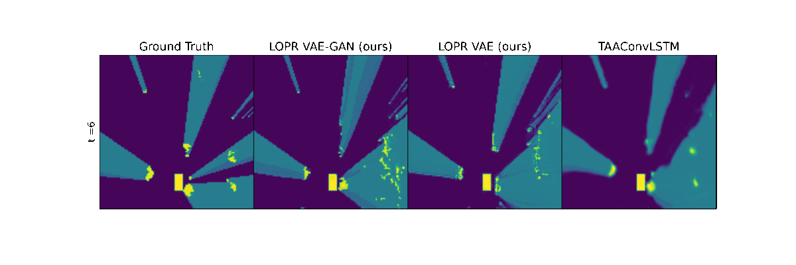
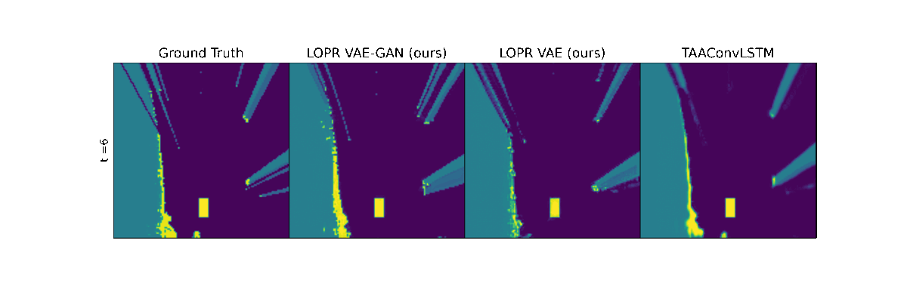

# LOPR: Latent Occupancy PRediction using Generative Models

This is the official implementation of LOPR used in "LOPR: Latent Occupancy PRediction using Generative Models" ([arXiv](https://arxiv.org/abs/2210.01249)).

## Abstract:
Environment prediction frameworks are essential for autonomous vehicles to facilitate safe maneuvers in a dynamic environment. Previous approaches have used occupancy grid maps as a bird’s eye-view representation of the scene and optimized the prediction architectures directly in pixel space. Although these methods have had some success in spatiotemporal prediction, they are, at times, hindered by unrealistic and incorrect predictions. We postulate that the quality and realism of the forecasted occupancy grids can be improved with the use of generative models. We propose a framework that decomposes occupancy grid prediction into task-independent low-dimensional representation learning and task-dependent prediction in the latent space. We demonstrate that our approach achieves state-of-the-art performance on the real-world autonomous driving dataset, NuScenes.

## Visualization

Below, we visualize two examples of predictions. For more results, check out our media folder and our preprint.




## Setup

- Python 3.6.9
- Libraries: See lopr_env.yml
- Tested on Ubuntu 20.04 + Nvidia TITAN RTX

## Training

1. Task-independent Representation Learning

```python
python -m torch.distributed.launch --nproc_per_node=N_GPUS --nnodes=1 --node_rank=0 scripts/train_encoder_generator.py --path DATASET_DIR 
```

2. Convert the OGM dataset to latent dataset.

```python
python scripts/process_dataset_to_latents.py --ogm_dataset_path OGM_DATASET_PATH --latent_dataset_path LATENT_DATASET_PATH --ckpt_path CKPT_PATH
```

3. Task-dependent Supervised Learning Learning

```python
python scripts/train_prediction.py --path LATENT_DATASET_PATH
```

<!-- ## Visualize results

```python
python scripts/visualize.py
``` -->
## References:

For the representation learning, we use the following implementations:
- part of the DriveGAN with encoder, generator, and discriminator implementation by Name et. al. available at: https://github.com/nv-tlabs/DriveGAN_code ([License](https://github.com/nv-tlabs/DriveGAN_code/blob/master/LICENSE))

DriveGAN implementation uses:

- VAE-GAN available at:  https://github.com/rosinality/stylegan2-pytorch ([License](https://github.com/nv-tlabs/DriveGAN_code/blob/master/LICENSE))

- Perceptual Similarity implementation available at: https://github.com/richzhang/PerceptualSimilarity ([License](https://github.com/nv-tlabs/DriveGAN_code/blob/master/LICENSE))

- StyleGAN custom ops available at:  https://github.com/NVlabs/stylegan2 ([License](https://github.com/nv-tlabs/DriveGAN_code/blob/master/LICENSE))

If you use this work, please cite:
```
@misc{lange2022lopr,
      title={LOPR: Latent Occupancy PRediction using Generative Models}, 
      author={Bernard Lange and Masha Itkina and Mykel J. Kochenderfer},
      year={2022},
      eprint={2210.01249},
      archivePrefix={arXiv},
      primaryClass={cs.RO}
}
```


